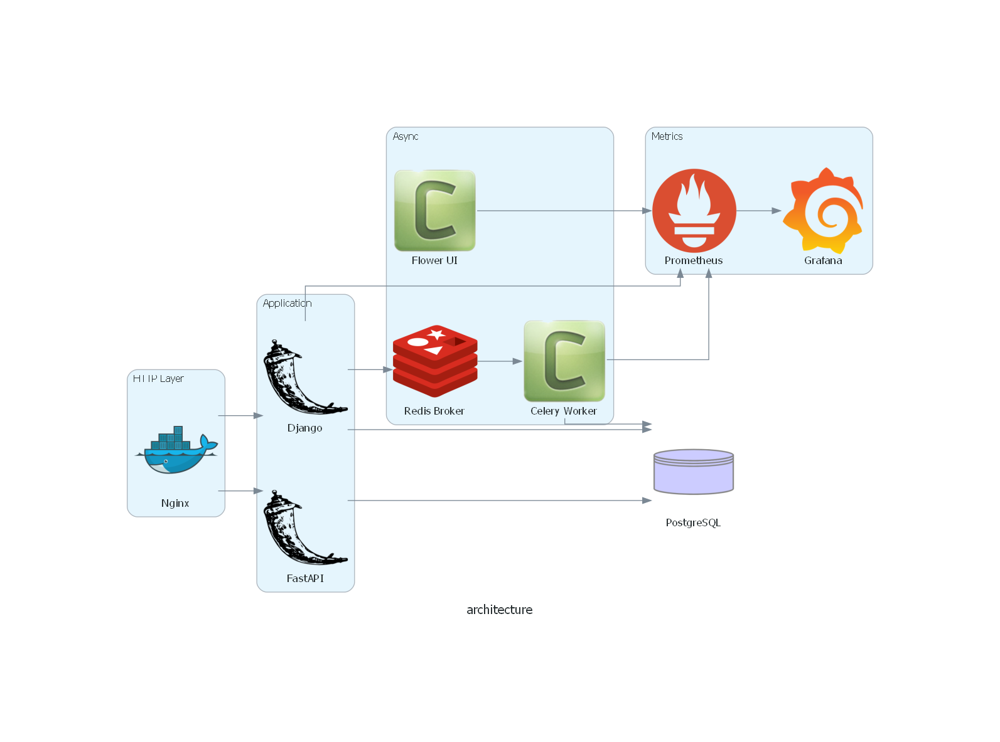

# ⚙️ Архитектура

## Компоненты

| Группа         | Сервис                            | Зачем нужен                          |
|----------------|-----------------------------------|--------------------------------------|
| Веб-фронт      | **Nginx**                         | SSL-терминация, статика, рейт-лимит  |
| Бизнес-логика  | **Django**                        | Админка, API запросы                 |
| REST API       | **FastAPI**                       | Отдельные API запросы для аналитиков |
| Фоновые задачи | **Celery**                        | Детект аномалий в фоне               |
| Брокер         | **Redis**                         | Очереди Celery + кеш                 |
| Хранилище      | **PostgreSQL**                    | Хранение транзакционных данных       |
| Метрики        | **Prometheus + Grafana + Flower** | Метрики, дашборды, live-очередь      |

## Потоки данных

1. **Запрос пользователя**
   `Nginx` → `FastAPI` (`/analytics/…`) **или** `Django` (`/admin/…`).

2. **Синхронная логика**
   Приложение обращается к `PostgreSQL`; быстрый ответ уходит клиенту.

3. **Долгая задача**
   `Django` кладёт job в `Redis` (`Celery broker`) → немедленно возвращает `202 Accepted`.

4. **Worker**
   `Celery worker` читает задачу, обрабатывает, пишет результат назад в БД.

5. **Мониторинг**
   * Метрики задач (`flower_task_*`) и приложений (`process_cpu_seconds_total`, …) скрапятся `Prometheus`.
   * `Grafana` дашборд «Celery Tasks» показывает успехи/ошибки, время выполнения.

6. **Расписание скриптов**
   * Каждый день в 03:00 запускается `Celery Beat`, который проверяет аномалии в транзакциях

7. **Multiprocessing**
   * Каждый день в 02:00 запускается `Celery Beat`, который записывает транзакции из CSV файла из `data` с помощью multiprocessing
